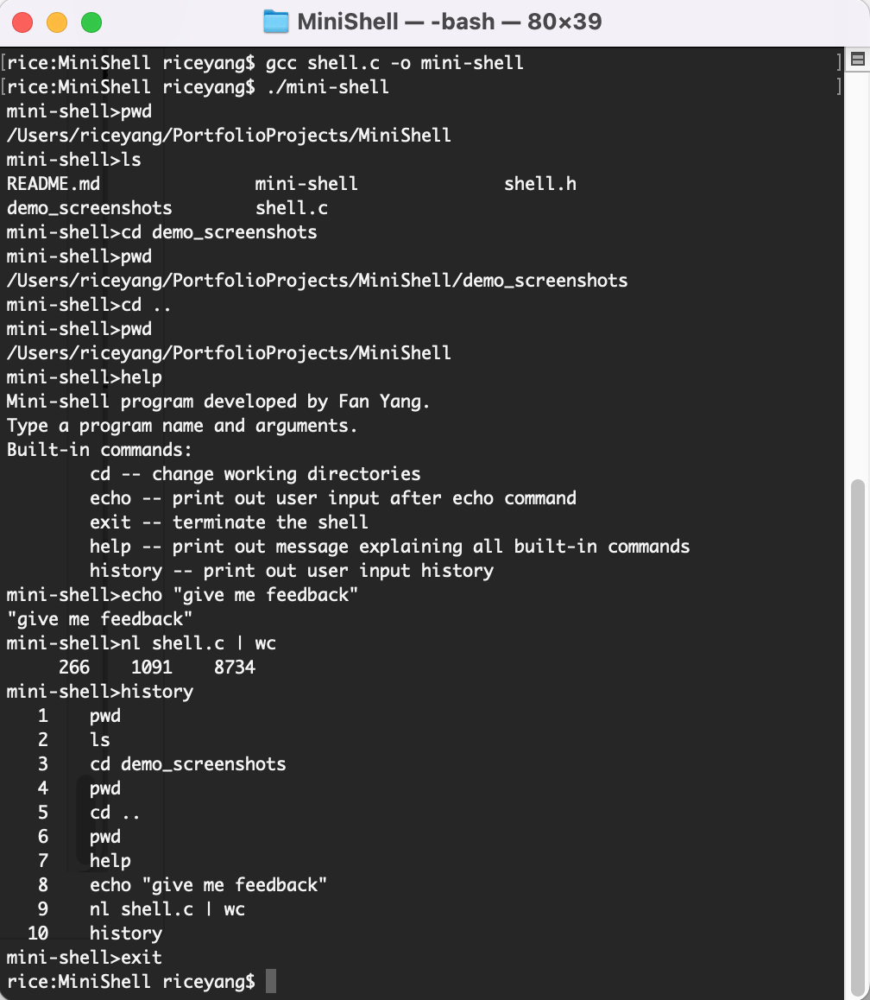

# MiniShell Application

### General Introduction

Read in commands from user input and execute in an infinite loop

Implemented 5 commands (cd, history, help, echo, exit) as built-in functions

Delegated to child processes if the command to be executed is not built-in

Ready to handle a pipe operator ‘|’ using file descriptors and the ‘dup2’ command

### Demo Screenshot

